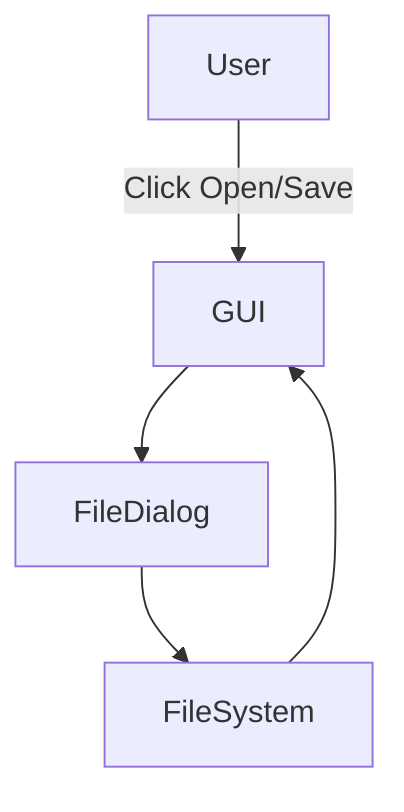
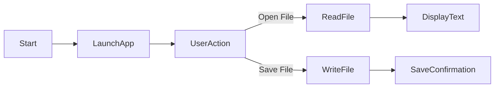
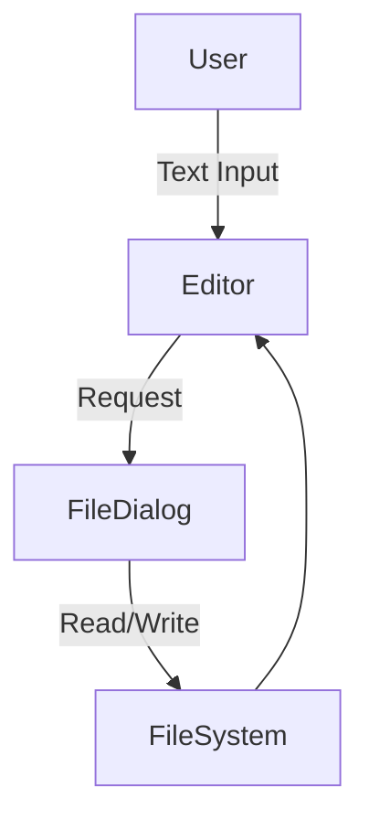

# 📝 Cool_Project_2 — Python GUI Text Editor

  <b>A lightweight, beginner-friendly desktop text editor built using Python & Tkinter</b>

  
  
  
  
  

---

<h2>📌 Project Overview</h2>

### 🔹 Title
**Cool_Project_2 – Python Tkinter Text Editor**

### 🔹 Description
A simple yet powerful **desktop text editor application** developed using **Python’s Tkinter GUI framework**.  
It allows users to **open**, **edit**, and **save text files** with an intuitive graphical interface.

### 🔹 Key Objective
To demonstrate:
- GUI application development in Python
- File handling operations
- Event-driven programming
- Clean and readable code structure

---

<h2>📑 Table of Contents</h2>

- 📌 Project Overview  
- ⚙️ Features  
- 🧩 Code Explanation  
- 🏗 Architecture  
- 🔄 Flow Diagram  
- 📊 Data Flow Diagram (DFD)  
- 🛠 Technology Stack  
- 🚀 Installation & Usage  
- 💡 Use Cases  
- 🌍 Real-World Applications  
- ✅ Pros & ❌ Cons  
- 📈 Future Enhancements  

---

<h2>⚙️ Features</h2>

- 📂 Open `.txt` and all file formats
- 💾 Save edited content to new files
- 🖥 Clean and responsive GUI layout
- 🧠 Beginner-friendly and readable code
- ⚡ Lightweight & fast execution
- 🪟 Cross-platform (Windows, Linux, macOS)

---

<h2>🧩 Code Explanation</h2>

### 🔹 `open_file()`
- Opens file dialog
- Reads selected file content
- Displays text inside Tkinter Text widget

### 🔹 `save_file()`
- Opens save dialog
- Writes current editor content to file
- Updates window title dynamically

### 🔹 GUI Layout
- **Text Widget** → Main editing area
- **Frame Widget** → Button container
- **Buttons** → Open & Save functionality
- **Grid Layout** → Responsive resizing

---

<h2>🏗 Architecture Diagram</h2>

---

<h2>🔄 Application Flow Diagram</h2>

---

<h2>📊 Data Flow Diagram (DFD)</h2>

---

<h2>🛠 Technology Stack</h2>

+ Language: Python 3.x

- GUI Library: Tkinter

h File Handling: Native Python I/O

- OS Support: Windows / Linux / macOS

---

<h2>🚀 Installation & Usage</h2>

## 🔹 Prerequisites

- Python 3.x installed

## 🔹 Run Application

- python text_editor.py

- No external dependencies required.

---

<h2>💡 Use Cases</h2>

- 🧑‍🎓 Learning GUI development in Python

- 📝 Quick text editing without heavy IDEs

- 🧪 Prototyping file-based applications

- 👨‍🏫 Teaching event-driven programming

---

<h2>🌍 Real-World Applications</h2>

- Students: Notes & assignment drafting

- Developers: Editing config / log files

h Offices: Lightweight internal tools

- Education: Tkinter demonstration projects

h 📌 Example:
A school computer lab uses this app for basic text editing without installing heavy software.

---

<h2>✅ Pros & ❌ Cons</h2>

## ✅ Pros

- Simple & clean codebase

- No external libraries needed

- Cross-platform

h Easy to extend

## ❌ Cons

- No syntax highlighting

- No autosave feature

- Limited formatting options

- Not suitable for large files

---

<h2>📈 Future Enhancements</h2>

- 🔍 Search & replace

- 🎨 Syntax highlighting

- 💾 Autosave functionality

- 📁 Multi-tab support

- 🌙 Dark mode UI

---

  <b>⭐ If you like this project, give it a star on GitHub!</b> 
  🔗 <a href="https://github.com/alok-kumar8765/Cool_Project_2">github.com/alok-kumar8765/Cool_Project_2</a>

---

