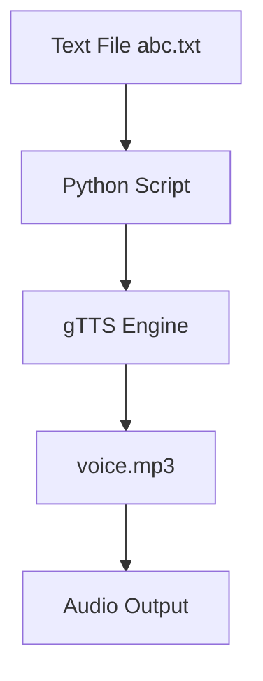
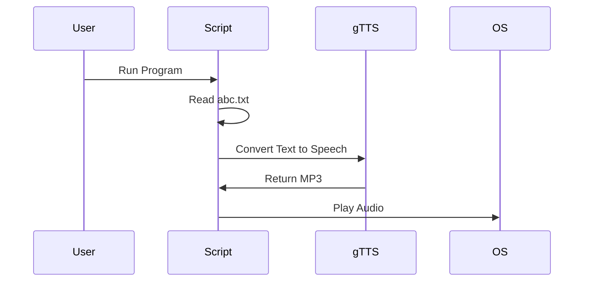

# 🔊 Text to Speech Converter using Python (gTTS)

<p align="center">
  
  
  
  
  
</p>

---

## 📌 Project Title
**Cool Project 2 – Text to Speech Converter using Google Text-to-Speech (gTTS)**

---

## 📝 Project Description
This project converts **text from a `.txt` file into human-like speech** using Python and the **Google Text-to-Speech (gTTS)** library.  
The generated speech is saved as an **MP3 audio file** and played automatically.

It demonstrates **file handling, third-party API usage, and OS-level execution** in a clean and minimal Python script.

---

<details>
<summary>📚 Table of Contents</summary>

- 📌 Overview  
- ⚙️ Features  
- 🧠 How It Works  
- 🧩 Code Explanation  
- 🗂️ Data Flow Diagram (DFD)  
- 🏗️ System Architecture  
- 🔄 Execution Flow Diagram  
- 🚀 Installation & Usage  
- 🌍 Real-World Use Cases  
- ✅ Pros & ❌ Cons  
- 🔮 Future Enhancements  

</details>

---

<details>
<summary>📌 Overview</summary>

- Reads text from a file (`abc.txt`)
- Converts text into speech using Google TTS
- Saves output as `voice.mp3`
- Automatically plays the audio file
- Lightweight & beginner-friendly

</details>

---

<details>
<summary>⚙️ Features</summary>

- ✅ Text-to-Speech conversion
- ✅ Uses Google’s natural voice engine
- ✅ Supports multiple languages (configurable)
- ✅ Automatic audio playback
- ✅ Minimal code & easy to extend

</details>

---

<details>
<summary>🧠 How It Works</summary>

1. Read text content from `abc.txt`
2. Pass text to `gTTS` engine
3. Generate speech in English
4. Save audio as `voice.mp3`
5. Play the audio using OS command

</details>

---

<details>
<summary>🧩 Code Explanation</summary>

```python
from gtts import gTTS
import os

# Read text from file
file = open("abc.txt", "r").read()

# Convert text to speech
speech = gTTS(text=file, lang='en', slow=False)

# Save as MP3
speech.save("voice.mp3")

# Play audio file
os.system("voice.mp3")
```

## Explanation:

- gTTS → Google Text-to-Speech library

- lang='en' → English language

- slow=False → Normal speech speed

- os.system() → Executes OS command to play audio


</details>

---

<details>
<summary>🗂️ Data Flow Diagram (DFD)</summary>



</details>

---

<details>
<summary>🏗️ System Architecture</summary>


</details>

---

<details>
<summary>🔄 Execution Flow Diagram</summary>



</details>


---

<details>
<summary>🚀 Installation & Usage</summary>

## Requirements

- Python 3.x

- Internet connection


Install Dependency

```
pip install gtts
```

Run Program

```
python main.py
```

> Make sure abc.txt exists in the same directory.


</details>

---

<details>
<summary>🌍 Real-World Use Cases</summary>

- 📚 Audiobook Generator
Convert study notes into audio for listening.

- ♿ Accessibility Tool
Help visually impaired users consume text content.

- 🧑‍💻 Voice Assistants
Base module for AI assistants (JARVIS-like systems).

- 📢 Automated Announcements
Schools, offices, or kiosks for voice alerts.


Example:
A student converts exam notes into audio and listens while traveling.

</details>

---

<details>
<summary>✅ Pros & ❌ Cons</summary>

##₹ ✅ Pros

- Simple and beginner-friendly

- High-quality natural voice

- Fast execution

- Free and open-source


### ❌ Cons

- Requires internet connection

- Limited voice customization

- Depends on Google TTS availability


</details>

---

<details>
<summary>🔮 Future Enhancements</summary>

- 🔊 Multi-language support

- 🎚️ Voice speed & pitch control

- 🖥️ GUI using Tkinter or PyQt

- 📱 Android / Web integration

- 🤖 Integration with AI chatbot


</details>

---

👨‍💻 Author

Alok Kumar

GitHub: alok-kumar8765


---

⭐ If you like this project, don’t forget to star the repository! ⭐

---
