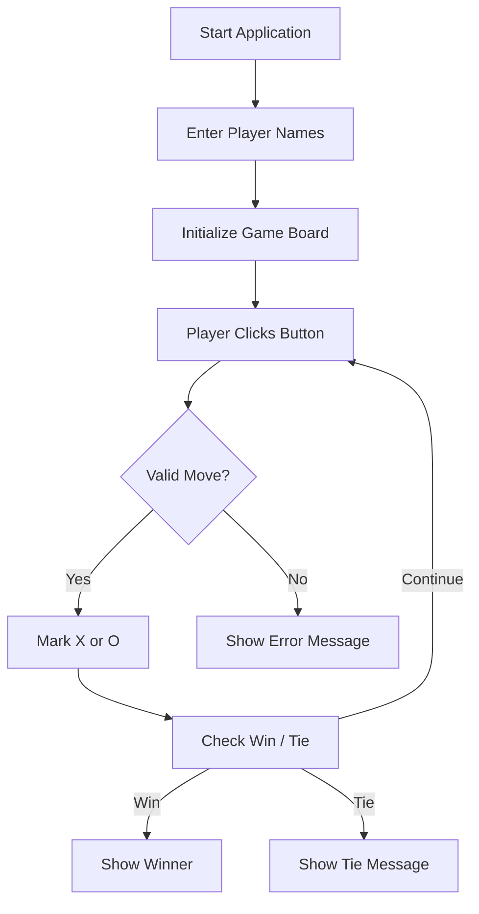
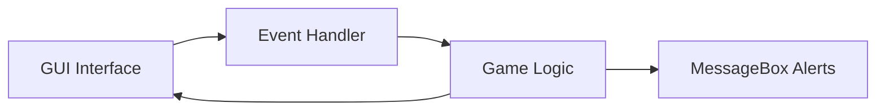
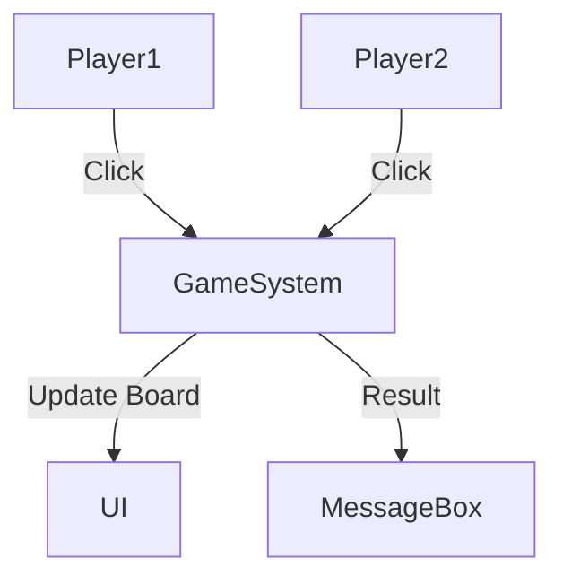

# 🎮 Tic Tac Toe – Python Tkinter GUI Application

  
  
  
  
  

---

<strong>📌 Project Overview</strong>

### 📖 Title
**Tic Tac Toe Game using Python & Tkinter**

### 📝 Description
A **GUI-based two-player Tic Tac Toe game** built using **Python's Tkinter library**.  
The application allows players to enter their names, take turns, detects wins/ties automatically, and displays results via dialog boxes.

### 🎯 Key Objectives
- Practice **event-driven programming**
- Understand **Tkinter GUI layouts**
- Implement **game logic & state management**
- Build a **desktop-based interactive application**

---

<strong>📚 Table of Contents</strong>

1. Project Overview  
2. Features  
3. Tech Stack  
4. Application Flow  
5. Architecture Diagram  
6. Data Flow Diagram (DFD)  
7. Game Logic Explanation  
8. Mermaid Diagrams  
9. Pros & Cons  
10. Real World Use Cases  
11. Example Scenarios  
12. Future Enhancements  

---

<strong>✨ Features</strong>

- 👥 Two-player gameplay
- 🧑 Player name input support
- 🔁 Turn-based logic (X / O)
- 🏆 Automatic win detection
- 🤝 Tie detection
- 🚫 Button disabling after game end
- 🎨 Simple & clean UI with colors
- 🖥️ Desktop GUI (No CLI interaction)

---

<strong>🛠️ Tech Stack</strong>

- **Language:** Python 3.x  
- **GUI Framework:** Tkinter  
- **Paradigm:** Event-driven programming  
- **Platform:** Cross-platform (Windows / Linux / macOS)

---

<strong>🔄 Application Flow</strong>

---

<strong>🏗️ Architecture Diagram</strong>

---

<strong>📊 Data Flow Diagram (DFD)</strong>

---

<strong>🧠 Game Logic Explanation</strong>

- btnClick()

- Handles button clicks

- Alternates between X and O

- Prevents overwriting moves

- checkForWin()

- Checks all win combinations

- Detects tie condition

- Triggers message popup

- disableButton()

- Locks the board after game ends

Global flags:

- bclick → manages turn

- flag → counts moves

---

<strong>✅ Pros & ❌ Cons</strong>

## ✅ Pros

- Beginner-friendly code

- Easy to understand logic

- Lightweight and fast

- No external dependencies

- Great for learning GUI programming

## ❌ Cons

- No AI / single-player mode

- Hardcoded win conditions

- No restart/reset button

- Uses global variables

- Not scalable for larger boards

---

<strong>🌍 Real World Use Cases</strong>

- 🎓 Education:
  - Used in schools/colleges to teach Python GUI basics

- 🧪 Practice Project:
  - Ideal for beginners learning event handling

- 🖥️ Desktop App Demo:
  - Showcases how Python can build GUI apps

- 🧠 Logic Building:
  - Helps understand condition checking & state flow

---

<strong>📌 Example Scenarios</strong>

- Player 1 enters name Alice

- Player 2 enters name Bob

- Alice plays first with X

- Bob plays with O

- Alice completes a row

- Popup shows: Alice Wins!

---

<strong>🚀 Future Enhancements</strong>

- 🔁 Restart / Reset button

- 🤖 Single-player mode with AI

- 📊 Scoreboard tracking

- 🌐 Online multiplayer

- 📱 Mobile-friendly version

- 🧩 MVC-based refactoring

---

  <strong>⭐ If you like this project, give it a star on GitHub!</strong> 
  🔗 <a href="https://github.com/alok-kumar8765/Cool_Project_2">alok-kumar8765/Cool_Project_2</a>

---

