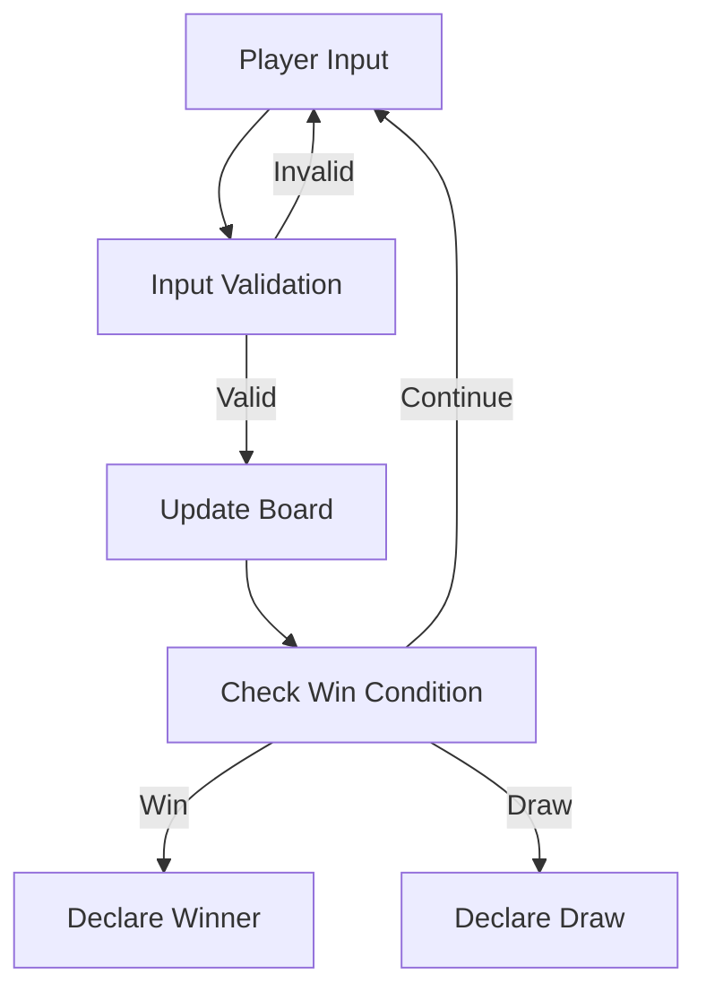
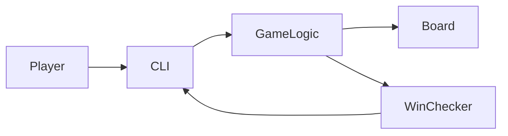

# 🎮 Cool Project 2 – Python Tic-Tac-Toe (CLI Based)

<p align="center">
  
  
  
  
  
</p>

<p align="center">
  <b>Author:</b> Alok Kumar  
  <br/>
  <b>GitHub:</b> <a href="https://github.com/alok-kumar8765">alok-kumar8765</a>
</p>

---

<details>
<summary><h2>📌 Project Description</h2></summary>

**Cool Project 2** is a **Python-based Command Line Tic-Tac-Toe game** designed to demonstrate:

- Clean game logic
- Minimalistic design
- Turn-based input handling
- Win condition evaluation

This project is ideal for **beginners**, **interview demos**, and **logic-building practice**.

</details>

---

<details>
<summary><h2>📚 Table of Contents</h2></summary>

1. Project Overview  
2. Features  
3. Game Rules  
4. Code Explanation  
5. Data Flow Diagram (DFD)  
6. System Architecture  
7. Game Flow Diagram  
8. Mermaid Diagrams  
9. Pros & Cons  
10. Real World Use Cases  
11. Example Scenarios  
12. How to Run  
13. Future Enhancements  

</details>

---

<details>
<summary><h2>✨ Features</h2></summary>

- ✔ Two-player turn-based gameplay
- ✔ Real-time board rendering
- ✔ Input validation
- ✔ Win & draw detection
- ✔ Lightweight & dependency-free
- ✔ Clean and readable Python code

</details>

---

<details>
<summary><h2>🕹️ Game Rules</h2></summary>

- The board has **9 positions (0–8)**
- Two players:
  - **X** (Player 1)
  - **O** (Player 2)
- Players take turns entering a number (0–8)
- A player wins if they align **3 symbols**:
  - Horizontally
  - Vertically
  - Diagonally
- If the board fills with no winner → **Draw (Cat’s Game)**

</details>

---

<details>
<summary><h2>🧠 Code Explanation</h2></summary>

### 🔹 Board Representation
- Uses a **list of 9 elements**
- Empty spaces represented by `' '`

### 🔹 Player Switching
- Uses string reversal:
  
```python
players = players[::-1]
```

🔹 Win Check Logic

Uses predefined win condition tuples

Efficient set comparison for win detection


🔹 Input Validation

Ensures:

Numeric input

Valid range (0–8)

Empty square


</details>

---

<details>
<summary><h2>📊 Data Flow Diagram (DFD)</h2></summary>



</details>

---

<details>
<summary><h2>🏗️ System Architecture</h2></summary>



</details>

---

<details>
<summary><h2>🔄 Game Flow Diagram</h2></summary>
  
  
```mermaid
sequenceDiagramam
    participant P as Player
    participant G as Game Engine

    P->>G: Enter Move (0–8)
    G->>G: Validate Input
    G->>G: Update Board
    G->>G: Check Winner
    G-->>P: Display Board / Result
```

</details>

---

<details>
<summary><h2>✅ Pros & ❌ Cons</h2></summary>
  
  
## ✅ Pros

- Simple and readable

- No external libraries

- Beginner-friendly

- Efficient win checking

- Easy to extend


## ❌ Cons

- CLI only (no GUI)

- No AI opponent

- No save/load feature

- Single match only


</details>

---

<details>
<summary><h2>🌍 Real-World Use Cases</h2></summary>
  
- 🎓 Educational Tool
  - Used to teach Python basics, loops, conditions, and lists.

- 💼 Interview Demo Project
  - Demonstrates logic building and clean coding.

- 🧪 Prototype Game Engine
  - Can be extended into GUI or AI-based games.


</details>

---

<details>
<summary><h2>📌 Example Use Cases</h2></summary>
  
- Python bootcamp mini project

- College assignment

- Logic practice for beginners

- CLI game showcase

- Base for AI Tic-Tac-Toe


</details>

---

<details>
<summary><h2>▶️ How to Run</h2></summary>

```
  python tic_tac_toe.py
```

## Requirements:

- Python 3.x

- No external dependencies


</details>

---

<details>
<summary><h2>🚀 Future Enhancements</h2></summary>

- Add AI (Minimax Algorithm)

- GUI using Tkinter / Pygame

- Multiplayer over network

- Score tracking

- Replay option


</details>

---

<details>
<summary><h2>📄 License</h2></summary>

This project is licensed under the MIT License.
You are free to use, modify, and distribute.

</details>

---

⭐ If you like this project, don’t forget to star the repo!
🔗 GitHub: https://github.com/alok-kumar8765/Cool_Project_2

---
