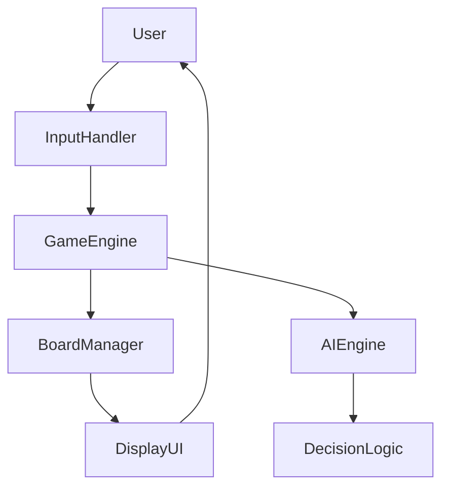
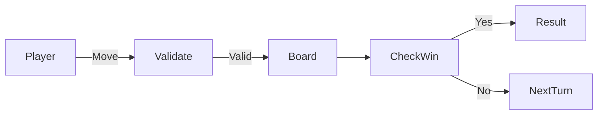
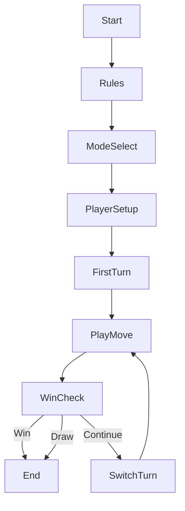

# 🎮 TIC TAC TOE – Python Console Game (AI Enabled)

<p align="center">
  
  
  
  
  
</p>

---

<details>
<summary><strong>📌 Project Overview</strong></summary>

### 🔹 Title
**TIC TAC TOE – Console Based Game with AI (Python)**

### 🔹 Description
A fully interactive **Python-based Tic Tac Toe game** supporting:
- Player vs Player
- Player vs Computer (AI)
- Computer vs Computer

The project demonstrates **clean logic design**, **game state management**, and a **rule-based AI engine** for decision making.

### 🔹 Key Highlights
- Modular & readable code
- Rule-based AI (Win → Block → Strategy)
- Input validation & replay support
- Console-friendly UI

</details>

---

<details>
<summary><strong>📑 Table of Contents</strong></summary>

1. Architecture Overview  
2. Data Flow Diagram (DFD)  
3. Game Flow Diagram  
4. System Architecture  
5. AI Logic Explanation  
6. Features  
7. Modes of Play  
8. Real World Use Cases  
9. Pros & Cons  
10. Tech Stack  
11. Execution Guide  

</details>

---

<details>
<summary><strong>🏗 System Architecture</strong></summary>



## Explanation

- InputHandler: Takes user/AI input

- GameEngine: Controls turns & rules

- AIEngine: Strategic move generation

- BoardManager: Board state updates

- DisplayUI: Console rendering


</details>

---

<details>
<summary><strong>📊 Data Flow Diagram (DFD)</strong></summary>



</details>

---

<details>
<summary><strong>🔁 Game Flow Diagram</strong></summary>



</details>

---

<details>
<summary><strong>🤖 AI Logic (Computer Player)</strong></summary>

### AI Strategy (Rule-Based)

1. Check Winning Move


2. Block Opponent Winning Move


3. Take Corners (1,3,7,9)


4. Take Center (5)


5. Take Edges (2,4,6,8)


### Why Rule-Based AI?

- Lightweight

- Fast execution

- Perfect for beginner/intermediate projects

- No external libraries required


</details>

---

<details>
<summary><strong>✨ Features</strong></summary>

- ✔ Interactive console UI

- ✔ Input validation

- ✔ AI vs Human support

- ✔ AI vs AI simulation

- ✔ Replay functionality

- ✔ Clean & modular functions


</details>

---

<details>
<summary><strong>🎮 Modes of Play</strong></summary>

## Mode	Description

- Player vs Player	Two humans
- Player vs Computer	Human vs AI
- Computer vs Computer	AI simulation


</details>

---

<details>
<summary><strong>🌍 Real World Use & Examples</strong></summary>

## Educational

- Learning Python fundamentals

- Teaching loops, conditions & functions


- AI Logic Demonstration

- Basic decision-making systems

- Game AI foundations


Example

> Used in coding workshops to explain how AI blocks user winning moves using logical prediction.


</details>

---

<details>
<summary><strong>📌 Use Cases</strong></summary>

- Python beginners practice project

- AI logic demo for interviews

- Console game prototype

- Teaching game loops & state management


</details>

---

<details>
<summary><strong>⚖ Pros & Cons</strong></summary>

## ✅ Pros

- Easy to understand

- Modular & scalable

- No external dependencies

- Fast execution


## ❌ Cons

- No GUI (console only)

- Rule-based AI (not ML)

- Limited board size (3x3)


</details>

---

<details>
<summary><strong>🛠 Tech Stack</strong></summary>

- Language: Python 3.x

- Libraries: random, time

- Paradigm: Procedural Programming


</details>

---

<details>
<summary><strong>▶ How to Run</strong></summary>

```
python tic_tac_toe.py
```

## Requirements

- Python 3.x installed

- Terminal / Command Prompt


</details>

---

<details>
<summary><strong>👤 Author</strong></summary>

Alok Kumar
GitHub: https://github.com/alok-kumar8765

</details>

---

<details>
<summary><strong>📜 License</strong></summary>

This project is open-source and free to use for learning and educational purposes.

</details>

---

> ⭐ If you like this project, don’t forget to star the repository! ⭐

---
