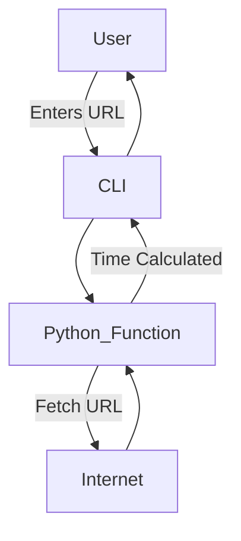
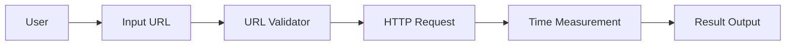
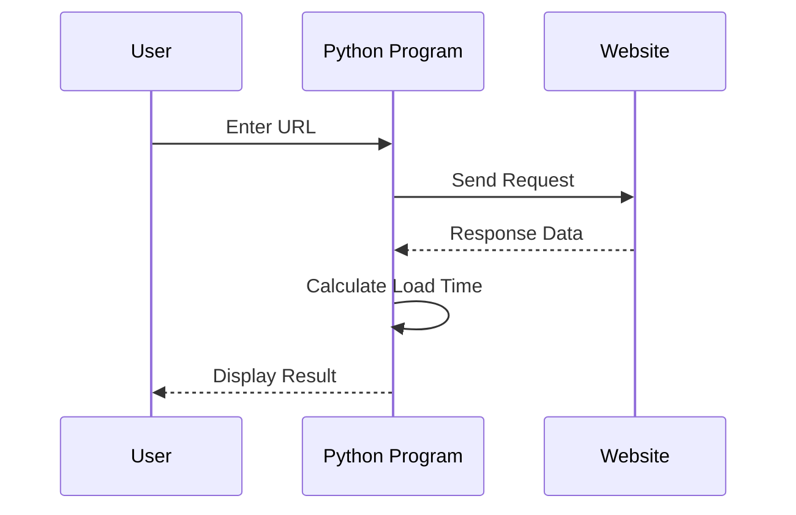

# 🚀 Cool Project 2 – Website Load Time Analyzer

---

## 📌 Project Title
**Website Load Time Analyzer using Python**

---

<strong>📖 Project Description</strong>

This project is a **lightweight Python-based CLI utility** that measures the **time taken to load a website URL**.  
It helps developers, testers, and system administrators **analyze website responsiveness** by calculating the total load duration in seconds.

The tool uses Python’s built-in networking and time modules to ensure:
- Minimal dependencies
- Accurate measurement
- Cross-platform compatibility

---

<strong>📂 Table of Contents</strong>

1. Project Overview  
2. Features  
3. Tech Stack  
4. How It Works  
5. Code Explanation  
6. Architecture Diagram  
7. Data Flow Diagram (DFD)  
8. Execution Flow Diagram  
9. Pros & Cons  
10. Real-World Use Cases  
11. Example Output  
12. Limitations  
13. Future Enhancements  

---

<strong>🎯 Project Overview</strong>

- **Input**: Website URL  
- **Process**: Measures network fetch duration  
- **Output**: Load time in seconds  
- **Mode**: Command Line Interface (CLI)

---

<strong>✨ Features</strong>

- ⏱️ Accurate load time measurement  
- 🌐 Supports HTTP & HTTPS URLs  
- 🧠 Automatic protocol handling  
- 🖥️ CLI-based (simple & fast)  
- 🧩 No external dependencies  

---

<strong>🛠 Tech Stack</strong>

- **Language**: Python 3  
- **Libraries**:
  - `urllib.request`
  - `time`
- **Execution**: Terminal / Command Prompt  

---

<strong>⚙️ How It Works</strong>

1. User inputs a website URL  
2. URL is validated for protocol  
3. Website content is fetched  
4. Start and end timestamps are recorded  
5. Load time is calculated and displayed  

---

<strong>📘 Code Explanation</strong>

### `get_load_time(url)`
- Accepts a URL string
- Opens the website using `urlopen`
- Reads the full response
- Measures execution time
- Returns load duration in seconds

### `__main__`
- Takes user input
- Calls the load time function
- Prints formatted result

---

<strong>🏗 Architecture Diagram</strong>

---

<strong>📊 Data Flow Diagram (DFD)</strong>

---

<strong>🔄 Execution Flow Diagram</strong>

---

<strong>✅ Pros & ❌ Cons</strong>

## ✅ Pros

- Simple and beginner-friendly

- No third-party dependencies

- Fast execution

- Works on any OS

## ❌ Cons

- Measures only total load time

- No DNS / TTFB breakdown

- No timeout handling

- No async support

---

<strong>🌍 Real-World Use Cases</strong>

Web Performance Testing
- Measure site responsiveness during development.

Server Health Monitoring
- Quickly verify if a website is slow or unreachable.

Educational Tool
- Learn about HTTP requests and performance metrics.

Automation Scripts
- Integrate into CI pipelines for uptime checks.

---

<strong>🧪 Example Output</strong>

Enter the url whose loading time you want to check: google.com

The time taken to load google.com is 0.42 seconds.

---

<strong>⚠️ Limitations</strong>

- No error handling for invalid URLs

- No retry mechanism

- Blocking I/O

- Does not handle redirects explicitly

---

<strong>🚀 Future Enhancements</strong>

- Add timeout & exception handling

- Measure DNS lookup & TTFB

- Async version using aiohttp

- GUI or Web Dashboard

- Logging & CSV export

---

## 👨‍💻 Author

Alok Kumar
GitHub: https://github.com/alok-kumar8765/Cool_Project_2

---

## 📄 License

This project is licensed under the MIT License – free to use, modify, and distribute.

---

> ⭐ If you find this project useful, please give it a star on GitHub!

---
