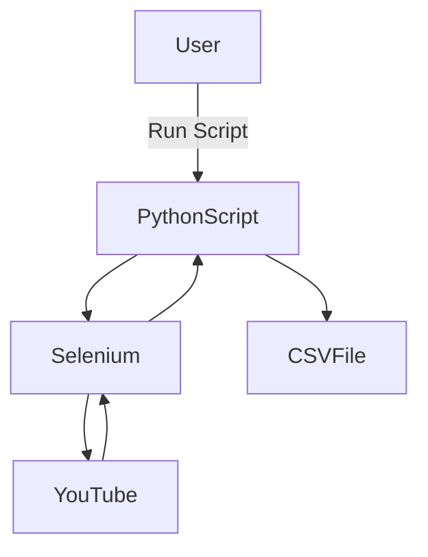
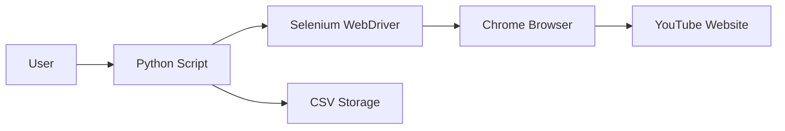

Below is a single-page, copy-paste ready, professional README.md written exactly to your requirements.
# 🎥 YouTube Comment Scraper using Selenium (Python)


---

## 📌 Project Title
**Automated YouTube Comment Scraper using Selenium & Python**

---

## 📖 Project Description
This project demonstrates how to **automatically scrape YouTube video comments** using **Python + Selenium WebDriver** and export them into a **CSV file**.  

It is designed for:
- Beginners learning **web automation**
- Data collection for **sentiment analysis**
- Research & content analysis
- Understanding how **Selenium interacts with dynamic websites**

---

## 📚 Table of Contents
<details>
<summary>Click to expand</summary>

1. Introduction  
2. Features  
3. Tech Stack  
4. How It Works  
5. Data Flow Diagram (DFD)  
6. System Architecture  
7. Execution Flow Diagram  
8. Installation & Setup Guide (Beginner Friendly)  
9. Running the Project  
10. Code Explanation  
11. Output Format  
12. Real-World Use Cases  
13. Pros & Cons  
14. Limitations  
15. Future Enhancements  
16. License  
17. Author  

</details>

---

## 🚀 Features
<details>
<summary>Click to expand</summary>

- Automated browser control using Selenium
- Scrolls dynamically loaded YouTube comments
- Extracts:
  - Comment Author
  - Comment Text
- Saves data into CSV format
- Beginner-friendly Python code
- No YouTube API required

</details>

---

## 🛠️ Tech Stack
<details>
<summary>Click to expand</summary>

- **Language:** Python 3.x
- **Automation Tool:** Selenium WebDriver
- **Browser:** Google Chrome
- **Driver:** ChromeDriver
- **Output Format:** CSV

</details>

---

## ⚙️ How It Works
<details>
<summary>Click to expand</summary>

1. Launches Google Chrome using Selenium
2. Opens a YouTube video URL
3. Scrolls down to load comments dynamically
4. Extracts usernames and comments using XPath
5. Stores extracted data into a CSV file

</details>

---

## 📊 Data Flow Diagram (DFD)
<details>
<summary>Click to expand</summary>



</details>

---

## 🏗️ System Architecture

<details>
<summary>Click to expand</summary>
  


</details>

---

## 🔄 Execution Flow Diagram

<details>
<summary>Click to expand</summary>
  
```mermaid  
  sequence Diagramram
    User->>Python: Run Script
    Python->>Selenium: Initialize Driver
    Selenium->>Chrome: Launch Browser
    Chrome->>YouTube: Open Video URL
    Selenium->>YouTube: Scroll Page
    Selenium->>Python: Extract Comments
    Python->>CSV: Save Data
```

</details>

---

## 🧑‍💻 Installation & Setup Guide (For Absolute Beginners)

<details>
<summary>Click to expand</summary>
  
Step 1: Install Python

1. Download Python from: https://www.python.org/downloads/


2. ✅ Check "Add Python to PATH"


3. Install and verify:

```
python --version

```


---

Step 2: Install Google Chrome

Download from: https://www.google.com/chrome/


---

Step 3: Download ChromeDriver

1. Check your Chrome version:

Open Chrome → Settings → About


2. Download matching ChromeDriver: https://chromedriver.chromium.org/downloads


3. Extract chromedriver.exe


4. Place it in a known path (example):

C:/chromedriver/chromedriver.exe


---

Step 4: Install Selenium

```
pip install selenium

```

---

Step 5: Verify Installation

```
pip show selenium
```

</details>

---

## ▶️ Running the Project

<details>
<summary>Click to expand</summary>

1. Clone repository:

```
git clone https://github.com/alok-kumar8765/Cool_Project_2.git
```

2. Open Python file


3. Update ChromeDriver path:

```
driver = webdriver.Chrome("C:/chromedriver/chromedriver.exe")
```

4. Run script:

```python
python youtube_comment_scraper.py
```


</details>


---

## 🧠 Code Explanation

<details>
<summary>Click to expand</summary>

- webdriver.Chrome() → Launches browser

- get() → Opens YouTube URL

- execute_script() → Scrolls page

- find_elements_by_xpath() → Extracts comments

- csv.DictWriter() → Saves data to CSV


</details>

---

## 📁 Output Format

<details>
<summary>Click to expand</summary>

Author	Comment

> John Doe	Great video!
> Jane Smith	Very informative


Saved as:

> commentlist.csv

</details>


---

## 🌍 Real-World Use Cases

<details>
<summary>Click to expand</summary>

- 📈 Sentiment Analysis on YouTube comments

- 📊 Market research for product feedback

- 🎓 Academic research & NLP projects

- 🧠 AI training data collection

- 📢 Brand monitoring


Example:
A company analyzes comments on product review videos to understand customer satisfaction.

</details>

---

## ✅ Pros & ❌ Cons

<details>
<summary>Click to expand</summary>

## ✅ Pros

- No API key required

- Works on dynamic websites

- Easy to customize

- Beginner friendly


## ❌ Cons

- Slower than API

- Can break if YouTube changes UI

- Requires browser installation


</details>

---

## ⚠️ Limitations

<details>
<summary>Click to expand</summary>

- Limited number of comments loaded

- XPath may change

- Requires internet connection

- Not suitable for massive scraping


</details>


---

## 🚀 Future Enhancements

<details>
<summary>Click to expand</summary>

- Auto-scroll until all comments load

- Multi-video support

- Sentiment analysis integration

- Headless browser mode

- Cloud deployment


</details>

---

## 📄 License

<details>
<summary>Click to expand</summary>

This project is licensed under the MIT License.

</details>

---

👤 Author

<details>
<summary>Click to expand</summary>
Alok Kumar Kaushal

GitHub: https://github.com/alok-kumar8765
Email : mailto:alokkaushal42@gmail.com
</details>

---

> ⭐ If you found this project useful, give it a star on GitHub!

---
