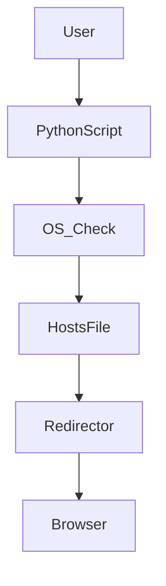
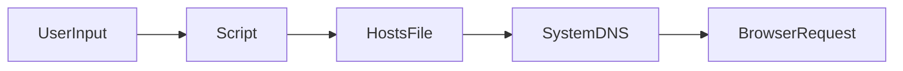
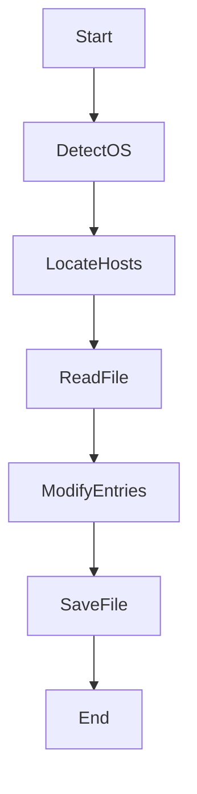

# 🚫 Website Blocker & Unblocker (Python)

<p align="center">
  
  
  
  
</p>

<p align="center">
  🔗 <b>GitHub:</b> https://github.com/alok-kumar8765/Cool_Project_2
</p>

---

## 📌 Project Title
**Python Website Blocker & Unblocker using Hosts File**

---

## 📖 Project Description
This project provides a **simple, OS-level website blocking and unblocking mechanism** using Python by modifying the system’s `hosts` file.  
It works **without internet, browsers, extensions, or third-party software**.

✔ Blocks distracting or harmful websites  
✔ Works at **system level**  
✔ Lightweight & fast  
✔ Cross-platform (Windows & Linux)

---

## 📂 Table of Contents
<details>
<summary><b>Click to expand</b></summary>

1. Overview  
2. Features  
3. Technologies Used  
4. Project Structure  
5. How It Works  
6. Code Explanation  
7. Architecture Diagram  
8. Data Flow Diagram (DFD)  
9. Process Flow Diagram  
10. Usage Instructions  
11. Real-World Use Cases  
12. Pros & Cons  
13. Limitations  
14. Future Enhancements  
15. Security Notes  

</details>

---

## 🔍 Overview
<details>
<summary>Expand</summary>

This project contains **two Python scripts**:

- `website_blocker.py` → Blocks specified websites
- `website_unblocker.py` → Restores access by removing entries

It works by redirecting website domains to `127.0.0.1` (localhost).

</details>

---

## ✨ Features
<details>
<summary>Expand</summary>

- ✅ OS detection (Windows / Linux)
- ✅ Direct system-level blocking
- ✅ No external dependencies
- ✅ Easy to customize website list
- ✅ Reversible blocking (safe)

</details>

---

## 🛠 Technologies Used
<details>
<summary>Expand</summary>

- **Python 3**
- **Platform Module**
- **Operating System Hosts File**

</details>

---

## 📁 Project Structure
<details>
<summary>Expand</summary>

```text
Cool_Project_2/
│
├── website_blocker.py
├── website_unblocker.py
└── README.md
```
</details>

---

⚙️ How It Works

<details>
<summary>Expand</summary>Detects OS using platform.system()

- Locates system hosts file

- Adds or removes website mappings

- Redirects blocked domains to localhost


</details>

---

## 🧠 Code Explanation

<details>
<summary>Expand</summary>
  
### Website Blocker

- Reads hosts file

- Checks if website already exists

- Adds redirection entry if missing


### Website Unblocker

- Reads all lines

- Filters blocked websites

- Rewrites clean hosts file


</details>

---

## 🏗 Architecture Diagram

<details>
<summary>Expand</summary>



</details>

---

## 📊 Data Flow Diagram (DFD)

<details>
<summary>Expand</summary>
  


</details>

---

## 🔄 Process Flow Diagram

<details>
<summary>Expand</summary>
  


</details>

---

## ▶ Usage Instructions

<details>
<summary>Expand</summary>
  

- Block Websites

> python website_blocker.py

- Unblock Websites

> python website_unblocker.py

⚠ Run with Administrator / Root privileges

</details>

---

## 🌍 Real-World Use Cases

<details>
<summary>Expand</summary>
  
- 👨‍🎓 Students – Avoid distractions during study hours

- 🏢 Offices – Block social or adult sites

- 👪 Parental Control – Child-safe browsing

- 🧘 Productivity – Digital detox


Example:
A company blocks adult sites on shared systems without installing browser extensions.

</details>

---

## 👍 Pros & 👎 Cons

<details>
<summary>Expand</summary>
  
### Pros

- Fast & lightweight

- No internet required

- System-wide enforcement

- Simple & transparent


### Cons

- Requires admin access

- Not time-based

- Advanced users can bypass manually


</details>

---

## ⚠ Limitations

<details>
<summary>Expand</summary>
  
- DNS-level only

- No GUI

- No logging

- Manual website list


</details>

---

## 🚀 Future Enhancements

<details>
<summary>Expand</summary>
  
- ⏰ Time-based blocking

- 🖥 GUI interface

- 📜 Logging & reports

- 🔐 Password-protected unblock

- 🌐 MacOS support


</details>


---

## 🔐 Security Notes

<details>
<summary>Expand</summary>

- Always backup hosts file

- Use with admin rights responsibly

- Avoid blocking critical domains


</details>


---

## 📜 License

<details>
<summary>Expand</summary>MIT License – Free to use, modify, and distribute.

</details>

---

## ⭐ Support

> If you like this project, give it a star ⭐ on GitHub
and feel free to contribute or raise issues.


---

Author: Alok Kumar
GitHub: alok-kumar8765

---

