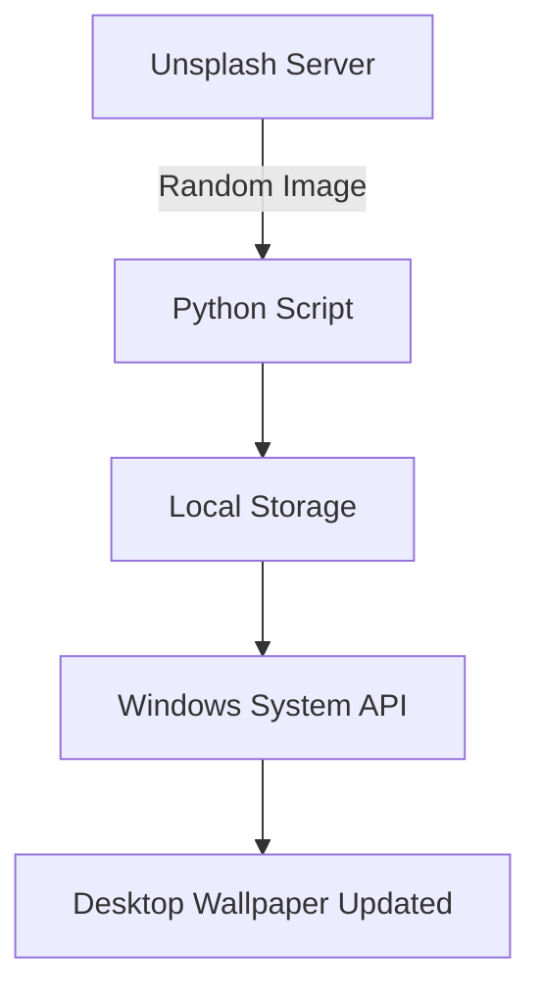
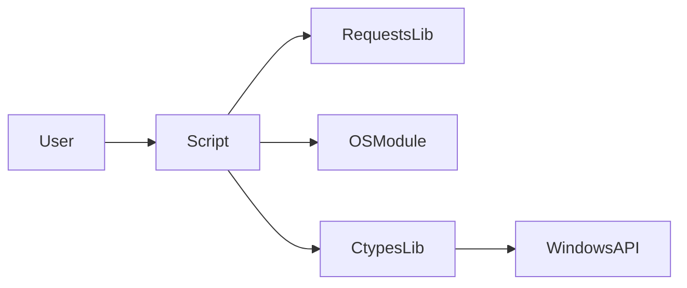
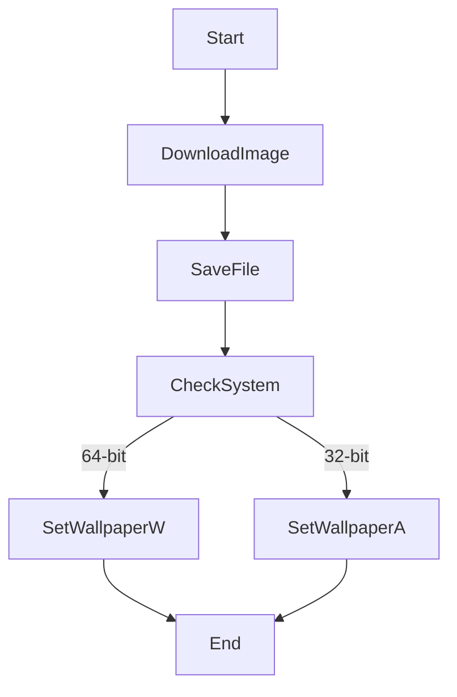

# 🖼️ Cool Project 2 — Automatic Random Wallpaper Changer (Windows)

<p align="center">
  <b>A Python utility that downloads a random image from Unsplash and sets it as the Windows desktop wallpaper automatically.</b>
</p>

<p align="center">
  <a href="https://github.com/alok-kumar8765/Cool_Project_2">
    
  </a>
  
  
  
  
</p>

---

<details>
<summary><h2>📌 Table of Contents</h2></summary>

- 📖 Project Overview  
- 🎯 Features  
- 🧠 How It Works  
- 🗂️ Project Structure  
- 🔄 Execution Flow  
- 📊 Data Flow Diagram (DFD)  
- 🏗️ System Architecture  
- 🔁 Flow Diagram  
- ⚙️ Installation & Usage  
- 🧩 Code Explanation  
- ✅ Pros & ❌ Cons  
- 🌍 Real-World Use Cases  
- 🧪 Example Scenarios  
- 🔐 Limitations & Notes  
- 📜 License  

</details>

---

<details>
<summary><h2>📖 Project Overview</h2></summary>

**Cool Project 2** is a lightweight Python automation script that:

- Downloads a **random image** from Unsplash
- Saves it locally
- Automatically sets it as the **Windows desktop wallpaper**
- Works for both **32-bit and 64-bit** Windows systems

This project demonstrates **system-level automation**, **HTTP requests**, and **OS-level API usage** using Python.

</details>

---

<details>
<summary><h2>🎯 Features</h2></summary>

- ✔️ Random wallpaper fetching
- ✔️ Automatic Windows wallpaper update
- ✔️ 32-bit & 64-bit compatibility detection
- ✔️ Simple and minimal dependencies
- ✔️ Beginner-friendly automation example

</details>

---

<details>
<summary><h2>🧠 How It Works</h2></summary>

- Fetches a random image from **Unsplash**
- Stores it as `random.jpg`
- Detects system architecture (32/64 bit)
- Uses **Windows SystemParametersInfo API**
- Updates the desktop wallpaper instantly

</details>

---

<details>
<summary><h2>🗂️ Project Structure</h2></summary>

Cool_Project_2/ │ ├── wallpaper.py        # Main script ├── random.jpg          # Downloaded image └── README.md           # Documentation

</details>

---

<details>
<summary><h2>🔄 Execution Flow</h2></summary>

- Start Program
- Download Image
- Detect OS Architecture
- Apply Wallpaper
- Exit Program

</details>

---

<details>
<summary><h2>📊 Data Flow Diagram (DFD)</h2></summary>



</details>

---

<details>
<summary><h2>🏗️ System Architecture</h2></summary>



</details>

---

<details>
<summary><h2>🔁 Flow Diagram</h2></summary>



</details>

---

<details>
<summary><h2>⚙️ Installation & Usage</h2></summary>

## Prerequisites

- Python 3.x

- Windows OS

- Internet connection


Install Dependencies

```text
pip install requests
```

Run Script

```python
python wallpaper.py
```

</details>


---

<details>
<summary><h2>🧩 Code Explanation</h2></summary>

- is_64bit()

- Detects system architecture


- download(url, file_name)

- Downloads and saves image


- setup(path)

- Applies wallpaper using Windows API


- ctypes.windll.user32.SystemParametersInfo

- Communicates directly with Windows system


</details>


---

<details>
<summary><h2>✅ Pros & ❌ Cons</h2></summary>

## ✅ Pros

- Simple & lightweight

- No API key required

- Demonstrates OS automation

- Ideal for beginners


## ❌ Cons

- Windows only

- No image resolution control

- Overwrites previous image

- No scheduling feature (manual run)


</details>


---

<details>
<summary><h2>🌍 Real-World Use Cases</h2></summary>

- 🖥️ Daily wallpaper automation

- 🎨 Creative desktop customization

- 🧑‍💻 Learning OS-level scripting

- 🏢 Office or kiosk display refresh

- 🤖 Base for AI-generated wallpaper automation


</details>

---

<details>
<summary><h2>🧪 Example Scenarios</h2></summary>

- A developer runs the script daily for fresh inspiration

- A public system auto-updates wallpapers

- A student learns Windows API interaction

- Used as a scheduled task via Windows Task Scheduler


</details>

---

<details>
<summary><h2>🔐 Limitations & Notes</h2></summary>

- Requires active internet connection

- Unsplash image may vary in resolution

- No error recovery for corrupted downloads

- Designed only for Windows environments


</details>

---

<details>
<summary><h2>📜 License</h2></summary>This project is licensed under the MIT License.
You are free to use, modify, and distribute it.


---

👨‍💻 Author

Alok Kumar
GitHub: alok-kumar8765

</details>

---
