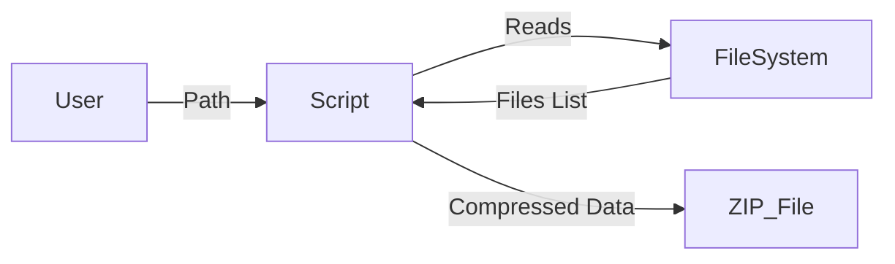
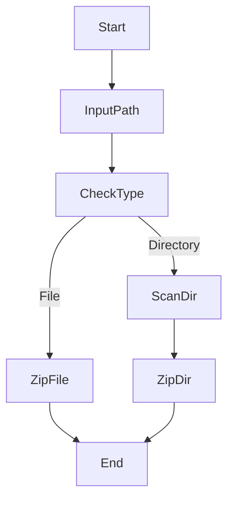

# 📦 Cool_Project_2 – Python File & Directory Zipper

<p align="center">
  
  
  
  
  
</p>

---

## 🧠 Project Overview

<details>
<summary><strong>📖 Description</strong></summary>

**Cool_Project_2** is a lightweight, command-line based Python utility that compresses  
✔ **single files** or  
✔ **entire directories (including nested files & folders)**  

into a `.zip` archive using Python’s built-in `zipfile` module.

It automatically detects whether the input path is a file or a directory and applies the correct compression logic.

</details>

---

## 📑 Table of Contents

<details>
<summary><strong>📚 Click to Expand</strong></summary>

1. Project Overview  
2. Features  
3. Technologies Used  
4. How It Works  
5. Execution Flow  
6. Architecture Diagram  
7. Data Flow Diagram (DFD)  
8. Flow Diagram  
9. Code Explanation  
10. Pros & Cons  
11. Real-World Use Cases  
12. Example Scenarios  
13. Future Improvements  
14. License  

</details>

---

## ✨ Features

<details>
<summary><strong>🚀 Key Capabilities</strong></summary>

- 📂 Compress **entire directories recursively**
- 📄 Compress **single files**
- 🧠 Automatic file/directory detection
- ⚡ Fast & lightweight (no external libraries)
- 🖥 CLI-based (scriptable & automation-friendly)
- 🔐 Uses ZIP_DEFLATED compression

</details>

---

## 🛠 Technologies Used

<details>
<summary><strong>🧩 Tech Stack</strong></summary>

- **Python 3.x**
- `zipfile` – ZIP compression
- `os` – Directory traversal
- `sys` – Command-line arguments

</details>

---

## ⚙️ How It Works

<details>
<summary><strong>🔍 Internal Logic</strong></summary>

1. Accepts a path from command-line arguments
2. Checks whether the path is:
   - a **file** → compresses directly
   - a **directory** → scans all nested files
3. Creates a `.zip` archive with the same name
4. Preserves folder structure during compression

</details>

---

## 🔁 Execution Flow

<details>
<summary><strong>🔄 Step-by-Step Flow</strong></summary>

- Start program
- Read CLI argument
- Validate path
- Detect file or directory
- Apply respective zip logic
- Create `.zip` output
- Exit safely

</details>

---

## 🏗 Architecture Diagram

<details>
<summary><strong>🏛 System Architecture (Mermaid)</strong></summary>

```mermaid
graph TD
    A[User CLI Input] --> B[Python Script]
    B --> C{Path Type?}
    C -->|File| D[zip_file()]
    C -->|Directory| E[retrieve_file_paths()]
    E --> F[zip_dir()]
    D --> G[ZIP Output]
    F --> G[ZIP Output]
```

</details>

---

## 📊 Data Flow Diagram (DFD)

<details>
<summary><strong>📈 DFD Level 1</strong></summary>



</details>

---

## 🔀 Program Flow Diagram

<details>
<summary><strong>🧭 Control Flow</strong></summary>



</details>

---

## 🧩 Code Explanation

<details>
<summary><strong>🧠 Function Breakdown</strong></summary>

- zip_file(file_path)

- Compresses a single file

- Output: filename.zip


- retrieve_file_paths(dir_name)

- Recursively scans directory

- Returns list of absolute file paths


- zip_dir(dir_path, file_paths)

- Compresses all files

- Preserves directory structure


__main__

- Handles CLI input

- Decides which function to call


</details>

---

## ✅ Pros & ❌ Cons

<details>
<summary><strong>⚖ Advantages & Limitations</strong></summary>

### ✅ Pros

- Simple & beginner-friendly

- No third-party dependencies

- Cross-platform

- Automation-ready


## ❌ Cons

- No password protection

- No progress bar

- No selective file filtering

- CLI only (no GUI)


</details>

---

## 🌍 Real-World Use Cases

<details>
<summary><strong>🏢 Practical Applications</strong></summary>

- 📁 Backup personal folders

- 🚀 Package project source code

- 📤 Compress files before email upload

- 🧪 Archive logs for debugging

- 🖥 DevOps build artifact bundling


</details>

---

📌 Example Scenarios

<details>
<summary><strong>📝 Usage Examples</strong></summary>

```
python zipper.py myfile.txt
python zipper.py my_project_folder
```

Output:

- myfile.txt.zip

- my_project_folder.zip


</details>

---

🔮 Future Improvements

<details>
<summary><strong>🚧 Enhancements Roadmap</strong></summary>

- 🔐 Password-protected ZIPs

- 📊 Compression progress indicator

- 🎯 File type filtering

- 🖼 GUI using Tkinter / PyQt

- ☁ Cloud upload support


</details>

---

📄 License

<details>
<summary><strong>📜 License Info</strong></summary>This project is licensed under the MIT License.
Feel free to use, modify, and distribute.

</details>

---

<p align="center">
  🚀 Developed by <strong>Alok Kumar</strong>  
  🔗 GitHub: <a href="https://github.com/alok-kumar8765">alok-kumar8765</a>
</p>

---
