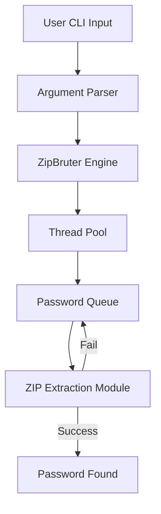
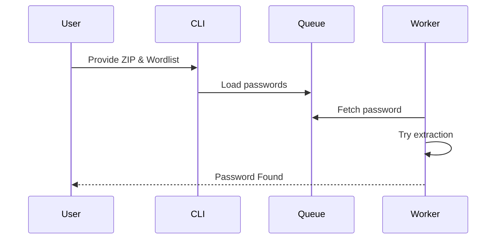

# 🔐 ZipBruter — Multithreaded ZIP Password Cracker

<p align="center">
  
  
  
  
  
</p>

---

<details open>
<summary><strong>📌 Project Overview</strong></summary>

### 📖 Description
**ZipBruter** is a **multithreaded ZIP password brute-force tool** written in Python.  
It attempts to crack password-protected ZIP files using a **dictionary (wordlist) attack** with configurable threading for improved performance.

> ⚠️ **Disclaimer**  
> This tool is strictly for **educational, ethical hacking, and recovery purposes**.  
> Unauthorized use against files you do not own is illegal.

---

### 🎯 Key Highlights
- 🚀 Multi-threaded brute force engine  
- 📂 Supports encrypted ZIP files  
- 🧠 FIFO queue based password dispatch  
- ⚙️ Custom thread control  
- 🧪 Lightweight & dependency-free  

</details>

---

<details>
<summary><strong>📚 Table of Contents</strong></summary>

1. Project Overview  
2. Features  
3. Installation  
4. Usage  
5. Code Explanation  
6. Architecture Diagram  
7. Data Flow Diagram (DFD)  
8. Execution Flow Diagram  
9. Pros & Cons  
10. Real-World Use Cases  
11. Legal & Ethical Notice  

</details>

---

<details>
<summary><strong>✨ Features</strong></summary>

- ✔ Dictionary-based password attack  
- ✔ Multi-threaded execution  
- ✔ Thread-safe FIFO Queue  
- ✔ Minimal system resource usage  
- ✔ Simple CLI interface  

</details>

---

<details>
<summary><strong>⚙️ Installation</strong></summary>

```bash
git clone https://github.com/alok-kumar8765/Cool_Project_2.git
cd Cool_Project_2
python3 zipbruter.py --help
```

## Requirements

- Python 3.x

-bEncrypted ZIP file

- Strong wordlist


</details>

---

<details>
<summary><strong>🚀 Usage</strong></summary>

```python

python3 zipbruter.py -f secret.zip -w wordlist.txt -t 8
```

Arguments

```
-f → Encrypted ZIP file

-w → Password wordlist

-t → Number of threads (default: 4)
```

</details>


---

<details>
<summary><strong>🧠 Code Explanation</strong></summary>

🔹 Core Components

- ZipBruter Class

- Controls password cracking logic


- Worker Threads

- Continuously fetch passwords from queue


- Queue (FIFO)

- Distributes passwords safely across threads


- ZipFile Module

- Attempts extraction with candidate passwords


🔹 Working Logic

- Load passwords from wordlist

- Push into shared queue

- Threads pick passwords concurrently

- Successful extraction reveals password


</details>

---

<details>
<summary><strong>🏗 Architecture Diagram</strong></summary>



</details>

---

<details>
<summary><strong>📊 Data Flow Diagram (DFD)</strong></summary>


</details>

---

<details>
<summary><strong>🔁 Execution Flow Diagram</strong></summary>


</details>


---

<details>
<summary><strong>✅ Pros & ❌ Cons</strong></summary>

## ✅ Pros

- Fast due to multithreading

- Simple & readable code

- No external dependencies

- Easy to customize


## ❌ Cons

- Dictionary attack only (no brute-mask)

- ZIPCrypto only (not AES-256)

- CPU bound for large wordlists


</details>

---

<details>
<summary><strong>🌍 Real-World Usage & Examples</strong></summary>

🔐 Use Cases

- Recovering forgotten ZIP passwords

- Ethical hacking labs & CTF challenges

- Cybersecurity education

- Password strength testing


🧪 Example

> A system admin forgets the password of a ZIP backup containing logs.
Using a known password pattern wordlist, ZipBruter recovers access safely.


</details>

---

<details>
<summary><strong>⚖️ Legal & Ethical Notice</strong></summary>

- ✔ Use only on files you own

- ✔ Follow local cyber laws

- ❌ Do NOT use for illegal access


> Developer is not responsible for misuse.


</details>

---

<p align="center">
  🚀 Developed by <strong>Alok Kumar</strong>  
  🔗 https://github.com/alok-kumar8765
</p>

---
