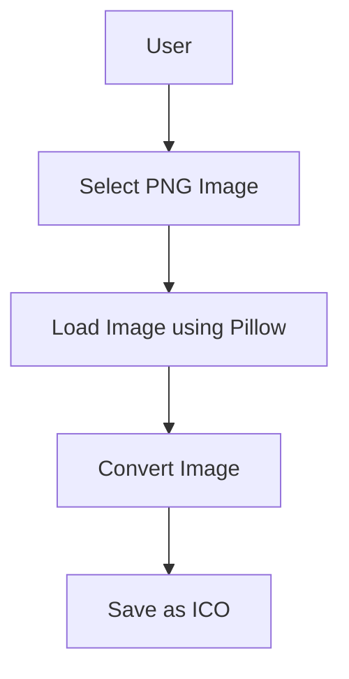
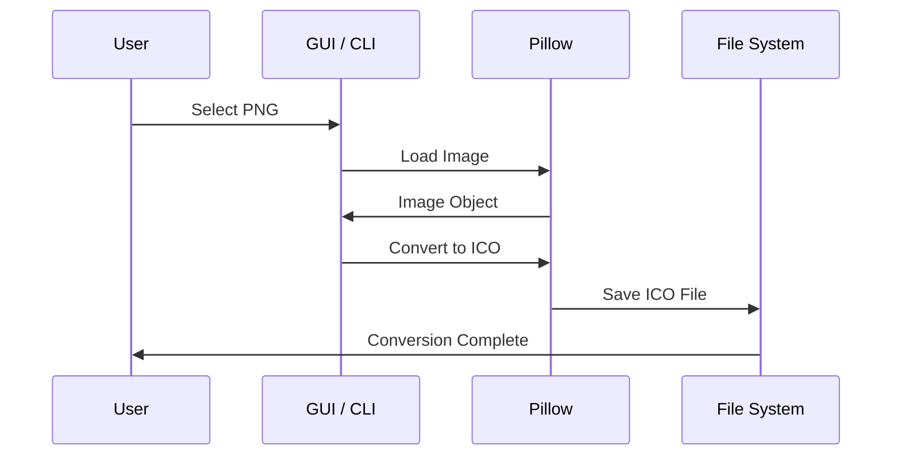

# 🖼️ PNG to ICO Converter (CLI + GUI)

<p align="center">
  
  
  
  
  
</p>

<p align="center">
  🔗 <b>GitHub Repository:</b> https://github.com/alok-kumar8765/Cool_Project_2
</p>

---

## 📌 Project Title
**PNG to ICO Converter – Command Line & GUI Based Tool**

---

<details>
<summary><h2>📖 Description</h2></summary>

This project provides a **simple yet professional PNG to ICO image converter** implemented in **Python** using the **Pillow (PIL)** library.

It includes:
- 🧩 **CLI-based converter** for quick automation
- 🖥️ **GUI-based converter** using **Tkinter** for non-technical users

This tool is ideal for generating `.ico` files commonly used in:
- Desktop applications
- Windows executables
- Website favicons

</details>

---

<details>
<summary><h2>📑 Table of Contents</h2></summary>

1. Overview  
2. Features  
3. Project Structure  
4. Code Explanation  
5. Data Flow Diagram (DFD)  
6. Architecture Diagram  
7. Application Flow Diagram  
8. Pros & Cons  
9. Real World Usage  
10. Use Cases  
11. Technologies Used  

</details>

---

<details>
<summary><h2>✨ Features</h2></summary>

- ✅ Convert PNG images to ICO format
- ✅ Lightweight & fast processing
- ✅ GUI support using Tkinter
- ✅ Error handling & user notifications
- ✅ Beginner-friendly & extensible

</details>

---

<details>
<summary><h2>📂 Project Structure</h2></summary>

```text
Cool_Project_2/
│
├── convert.py        # CLI-based PNG to ICO converter
├── convertUI.py      # GUI-based PNG to ICO converter
├── input.png         # Sample input file
├── output.ico        # Generated output file
└── README.md
```
</details>

---


<details>
<summary><h2>🧠 Code Explanation</h2></summary>

### 🔹 `convert.py` (CLI Version)

* Uses **Pillow Image module**
* Loads PNG image from current directory
* Saves converted ICO file in same directory

**Workflow**

* Open `input.png`
* Convert & save as `output.ico`

---

### 🔹 `convertUI.py` (GUI Version)

* Built using **Tkinter**
* Allows users to:

  * Browse PNG file
  * Convert & save ICO file
* Includes:

  * Error handling
  * Success alerts
  * Clean UI

**UI Components**

* Canvas
* Buttons
* File dialog
* Message box

</details>

---

<details>
<summary><h2>📊 Data Flow Diagram (DFD)</h2></summary>



</details>

---

<details>
<summary><h2>🏗️ Architecture Diagram</h2></summary>


</details>

---

<details>
<summary><h2>🔁 Application Flow Diagram</h2></summary>



</details>

---

<details>
<summary><h2>⚖️ Pros & Cons</h2></summary>

### ✅ Pros

* Simple & clean implementation
* Cross-platform support
* No internet required
* Easy to extend (batch conversion, resizing)

### ❌ Cons

* Supports only PNG → ICO
* No image preview
* Single file conversion (no batch mode yet)

</details>

---

<details>
<summary><h2>🌍 Real World Usage</h2></summary>

### Example:

A developer creating a **Windows desktop application** needs an `.ico` file for:

* Application icon
* Taskbar display
* Installer branding

This tool converts a PNG logo into a Windows-compatible ICO file instantly.

</details>

---

<details>
<summary><h2>🎯 Use Cases</h2></summary>

* 🖥️ Desktop Application Development
* 🌐 Website Favicon Creation
* 📦 Software Packaging
* 🧑‍🎓 Python Learning Projects
* 🛠️ Automation Scripts

</details>

---

<details>
<summary><h2>🧰 Technologies Used</h2></summary>

* **Python 3.x**
* **Pillow (PIL)**
* **Tkinter**
* **Mermaid (Documentation Diagrams)**

</details>

---

<p align="center">
  🚀 <b>Developed by:</b> Alok Kumar  
  <br>
  ⭐ If you like this project, give it a star on GitHub!
</p>


---

