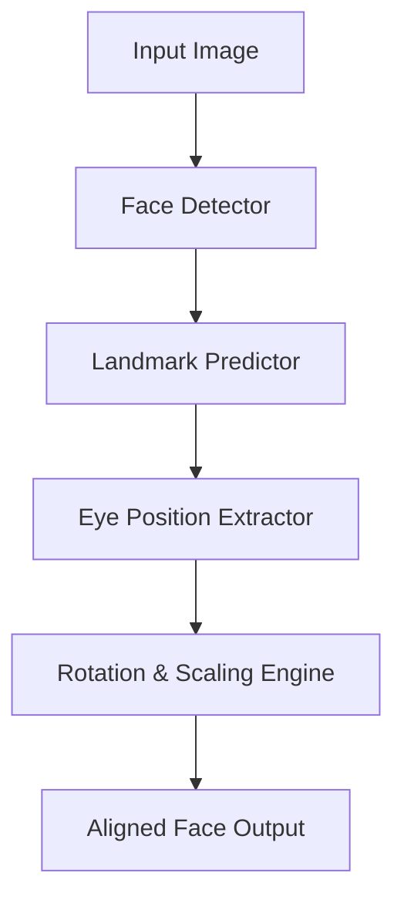
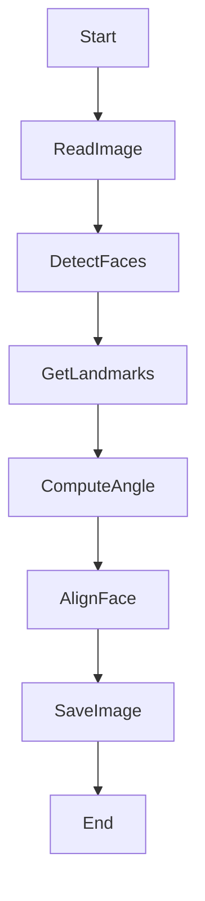

# 👁️ Face Detection & Alignment Tool  
### *Cool_Project_2*


---

<details>
<summary><strong>📌 Project Description</strong></summary>

This project is a **Python-based Face Detection and Face Alignment system** that:

- Detects faces from images
- Extracts facial landmarks using **Dlib**
- Aligns faces based on **eye positions**
- Outputs **normalized, rotated, and scaled face images**
- Saves multiple detected faces per image automatically

The output faces are perfectly aligned to a fixed size (**224×224**) making them ideal for **AI / ML / Face Recognition pipelines**.

</details>

---

<details>
<summary><strong>📂 Table of Contents</strong></summary>

1. Project Overview  
2. Features  
3. Tech Stack  
4. How It Works  
5. Architecture Diagram  
6. Data Flow Diagram (DFD)  
7. Processing Flow Diagram  
8. Installation  
9. Usage  
10. Configuration  
11. Pros & Cons  
12. Real-World Use Cases  
13. Example Scenarios  
14. Limitations  
15. License  

</details>

---

<details>
<summary><strong>✨ Features</strong></summary>

- ✅ Automatic face detection
- ✅ Multi-face support per image
- ✅ Eye-based geometric alignment
- ✅ Scale & rotation normalization
- ✅ High-quality cubic interpolation
- ✅ Dataset-ready face outputs
- ✅ CLI-based execution

</details>

---

<details>
<summary><strong>🛠 Tech Stack</strong></summary>

- **Python 3**
- **OpenCV**
- **Dlib**
- **NumPy**
- **68 Facial Landmark Model**

</details>

---

<details>
<summary><strong>⚙️ How It Works (Step-by-Step)</strong></summary>

- Load input images
- Detect faces using Dlib HOG detector
- Predict 68 facial landmarks
- Extract left & right eye points
- Calculate:
  - Eye center
  - Rotation angle
  - Scale factor
- Rotate, scale & align the face
- Save aligned face images

</details>

---

<details>
<summary><strong>🏗 Architecture Diagram</strong></summary>



</details>

---


<details>
<summary><strong>📊 Data Flow Diagram (DFD)</strong></summary>


</details>

---

<details>
<summary><strong>🔁 Processing Flow Diagram</strong></summary>



</details>

---

<details>
<summary><strong>📦 Installation</strong></summary>

```bash
pip install numpy opencv-python dlib
```

Download landmark model:

```
shape_predictor_68_face_landmarks.dat
```

Place it inside:

```
./dat/
```

</details>

---

<details>
<summary><strong>🚀 Usage</strong></summary>

```bash
python face_align.py image1.jpg image2.jpg
```

**Output:**

```
image1_face_000.jpg
image1_face_001.jpg
```

Each detected face is saved automatically.

</details>

---

<details>
<summary><strong>⚙️ Configuration</strong></summary>

* Output Size: `224 × 224`
* Eye Landmark Range:

  * Left Eye: `36–41`
  * Right Eye: `42–47`
* Eye Anchor Position:

  ```python
  LEFT_EYE_POS = (0.35, 0.3815)
  ```

</details>

---

<details>
<summary><strong>✅ Pros</strong></summary>

* ✔ High accuracy face alignment
* ✔ Industry-standard landmark model
* ✔ Dataset-ready output
* ✔ Multi-face handling
* ✔ Lightweight & fast

</details>

---

<details>
<summary><strong>❌ Cons</strong></summary>

* ✖ Requires external `.dat` model
* ✖ CPU-based (no GPU acceleration)
* ✖ Less accurate for extreme face angles
* ✖ No video stream support (image only)

</details>

---

<details>
<summary><strong>🌍 Real-World Use Cases</strong></summary>

* 🔐 Face Recognition Systems
* 📸 Photo Pre-processing
* 🤖 AI / ML Dataset Preparation
* 🎭 Emotion Detection Pipelines
* 🪪 Identity Verification Systems

</details>

---

<details>
<summary><strong>📘 Example Scenarios</strong></summary>

* **Attendance System**
  → Align faces before training recognition models

* **Security Cameras**
  → Normalize face images for comparison

* **Mobile Apps**
  → Pre-process selfies for AI filters

* **Research Projects**
  → Generate clean face datasets

</details>

---

<details>
<summary><strong>⚠️ Limitations</strong></summary>

* Works best on **frontal faces**
* Sensitive to poor lighting
* Requires clear eye visibility

</details>

---

<details>
<summary><strong>📄 License</strong></summary>

This project is licensed under the **MIT License**.
Free to use, modify, and distribute.

</details>

---

### ⭐ If you find this useful, don’t forget to **star the repository**

👉 **[https://github.com/alok-kumar8765/Cool_Project_2](https://github.com/alok-kumar8765/Cool_Project_2)**


---
