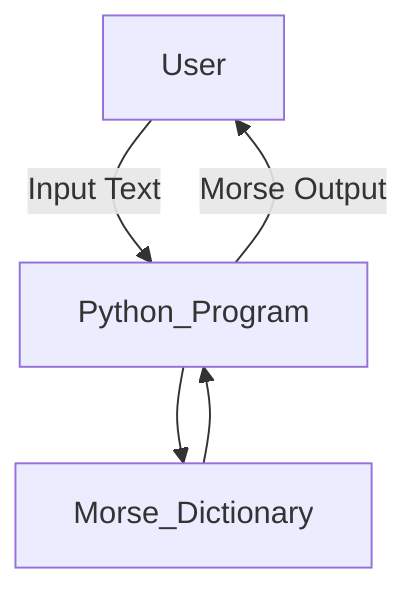
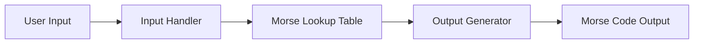
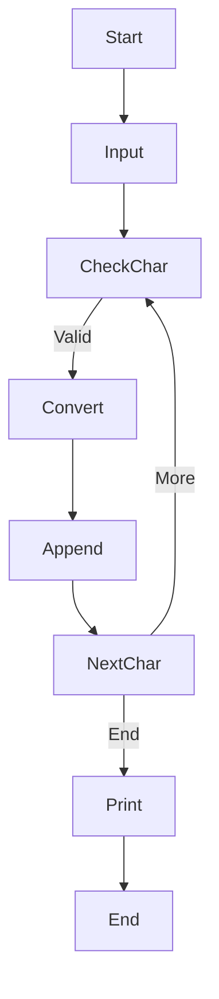

# 🔐 Cool Project 2 — Text to Morse Code Converter (Python)

<p align="center">
  
  
  
  
  
  
  
</p>

---

## 📌 Table of Contents (Indexed)

<details open>
<summary>Click to expand</summary>

1. [Project Overview](#-project-overview)
2. [Problem Statement](#-problem-statement)
3. [Solution Description](#-solution-description)
4. [How It Works](#-how-it-works)
5. [Architecture Diagram](#-architecture-diagram)
6. [Data Flow Diagram (DFD)](#-data-flow-diagram-dfd)
7. [Program Flow Diagram](#-program-flow-diagram)
8. [Code Explanation](#-code-explanation)
9. [Use Cases](#-use-cases)
10. [Real World Applications](#-real-world-applications)
11. [Example Input & Output](#-example-input--output)
12. [Pros & Cons](#-pros--cons)
13. [Limitations](#-limitations)
14. [Future Enhancements](#-future-enhancements)
15. [Tech Stack](#-tech-stack)
16. [How to Run](#-how-to-run)
17. [Author](#-author)

</details>

---

## 🧠 Project Overview

<details>
<summary>View details</summary>

This project is a **Python-based Text to Morse Code Converter**.  
It accepts user input (alphabetic text) and converts each character into its **Morse code equivalent** using a predefined dictionary.

✔ Lightweight  
✔ Beginner-friendly  
✔ Fast execution  
✔ Easy to extend  

</details>

---

## ❓ Problem Statement

<details>
<summary>View details</summary>

Converting plain text into Morse code manually is:
- Time-consuming
- Error-prone
- Not scalable

This project automates the conversion using Python for **accuracy and speed**.

</details>

---

## 💡 Solution Description

<details>
<summary>View details</summary>

- Uses a **dictionary (`symbols`)** to map alphabets to Morse code
- Accepts user input via console
- Iterates character-by-character
- Generates Morse output dynamically

</details>

---

## ⚙ How It Works

<details>
<summary>View details</summary>

1. User enters a word
2. Program checks each character
3. Matches character with Morse dictionary
4. Appends Morse symbols to output
5. Prints final Morse string

</details>

---

## 🏗 Architecture Diagram

<details>
<summary>View diagram</summary>


</details>

---

## 🔄 Data Flow Diagram (DFD)

<details>
<summary>View DFD</summary>



</details>

---

## 🔁 Program Flow Diagram

<details>
<summary>View flow</summary>
  


</details>

---

## 🧾 Code Explanation

<details>
<summary>View explanation</summary>Key Components

- symbols → Dictionary storing Morse mappings

- input() → Takes user text

- for loop → Iterates through characters

- .get() → Fetches Morse equivalent

- output string → Stores final result


</details>

---

## 📚 Use Cases

<details>
<summary>View use cases</summary>

- Learning Morse code

- Educational Python projects

- Console-based encoding tools

- Programming practice for beginners


</details>

---

## 🌍 Real World Applications

<details>
<summary>View applications</summary>

- Military & aviation signaling

- Emergency communication training

- Ham radio learning tools

- Cryptography basics


</details>

---

## 🧪 Example Input & Output

<details>
<summary>View example</summary>

Input

```
type: hello

```

Output

```
.... . .-.. .-.. ---

```

</details>

---

## ✅ Pros & ❌ Cons

<details>
<summary>View analysis</summary>✅ Pros

- Simple and readable

- Fast execution

- Easy to extend

- Beginner friendly


❌ Cons

- No uppercase handling

- No special characters

- No reverse conversion


</details>

---

## ⚠ Limitations

<details>
<summary>View limitations</summary>

- Only supports lowercase alphabets

- No error handling for invalid input

- No GUI or sound output


</details>

---

## 🚀 Future Enhancements

<details>
<summary>View roadmap</summary>

- Add text → Morse → text conversion

- Support uppercase & symbols

- Add sound (beep) output

- Build GUI using Tkinter

- Web version using Django / Flask


</details>

---

## 🧰 Tech Stack

<details>
<summary>View stack</summary>
  
- Language: Python 3.x

- Concepts: Dictionary, Loops, Input/Output

- Environment: CLI


</details>

---

## ▶ How to Run

<details>
<summary>View steps</summary>

```
python morse_converter.py
```

</details>

---

👤 Author

<details>
<summary>View author info</summary>Alok Kumar
🔗 GitHub: https://github.com/alok-kumar8765
📦 Repository: Cool_Project_2

</details>

---

⭐ If you found this useful, give the repo a star!

---
